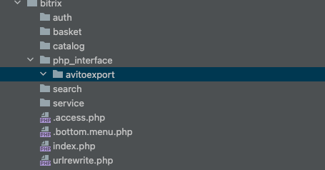
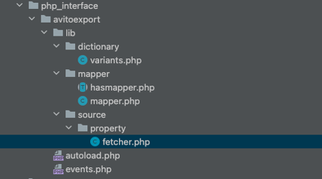
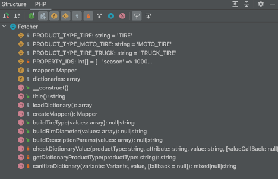

# bx_avito_event
# Пользовательские источники данных

В модуле **«Авито для бизнеса»** появилось событие **onFeedSourceBuild**

Которое позволяет создавать свою карту пользовательских свойств

Для этого необходимо создать файлы для сборки и получения результатов

Создадим новый неймспейс *avitoexport* для работы кода в директории *php_interface*

Пример пути

#document_root#\(bitrix|local)\php_interface\avitoexport



Все необходимые классы мы определяем внутри корневого неймспейса *\avitoexport*

Необходимые файлы для работы и сборки данных.

1. Трейт \avitoexport \lib\mapper\hasmapper.php
2. Класс \avitoexport \lib\mapper\mapper.php
3. Класс для работы со словарями \avitoexport \lib\mapper\mapper.php
4. Класс обработки свойства \avitoexport \lib\source\fetcher.php
5. Автоматический загрузчик файлов \avitoexport \lib\source\autoload.php
6. Регистрация пользовательского события \avitoexport \lib\source\events.php



Для автоматической загрузки необходимых классов нужно в init.php подключить вызов автозагрузчика:

```php
<?php

require_once __DIR__ . '/avitoexport/autoload.php';
```


Для примера будет рассмотрены события сборки свойств для раздела Авито

*Транспорт -> Запчасти и аксессуары -> Шины, диски и колёса*

Весь основной код работы события будет производиться в файле fetcher.php

Структура файла:



- Метод title()

Указывается название группы, где будут располагаться наши пользовательские свойства.

Которые будут отображаться в настройках сопоставления тэгов

- Метод loadDictionary()

Загрузка объекта для работы со словарями Авито

- Метод createMapper()

В данном методе создаются свойства которые мы хотим получить и сформировать для прайс-листа.

Метод должен возвращать объект Mapper.

Метод add добавляет в карту новое пользовательское поле данных

Параметры:

- Название и ID поля
- Вызываемый метод сборки значений текущего поля
- Входные массив значений обработки. Ключ – название, значения в массиве: тип получаемого значения, id – идентификатор свойства.

Типы получаемого значения:

```php
class Registry
{
   public const IBLOCK_FIELD = 'ELEMENT';
   public const IBLOCK_PROPERTY = 'ELEMENT_PROPERTY';
   public const SEO_FIELD = 'ELEMENT_SEO';
   public const OFFER_FIELD = 'OFFER';
   public const OFFER_PROPERTY = 'OFFER_PROPERTY';
   public const SECTION_PROPERTY = 'SECTION';
   public const CATALOG_FIELD = 'PRODUCT';
   public const STORE_FIELD = 'STORE';
   public const PRICE_FIELD = 'PRICE';
   public const TEMPLATE = 'TEMPLATE';
}
```

```php
/**
 * @description создание карты свойств для сопоставления и сборки данных при формировании файла выгрузки
 * @return \AvitoExport\PhpInterface\Mapper\Mapper
 */
protected function createMapper() : Mapper\Mapper
{
   $mapper = new Mapper\Mapper();

   $mapper->add('Event_TireType', [ $this, 'buildTireType' ], [
      'season' => [ Registry::IBLOCK_PROPERTY, self::PROPERTY_IDS['season'] ],
      'spiked' => [ Registry::IBLOCK_PROPERTY, self::PROPERTY_IDS['spiked'] ],
   ]);
   $mapper->add('Event_RimDiameter', [ $this, 'buildRimDiameter' ], [
      'RimDiameter' => [ Registry::IBLOCK_PROPERTY, self::PROPERTY_IDS['diameter'] ],
      'ProductType' => [ Registry::SECTION_PROPERTY, 'UF_AVITO_PRODUCTTYPE'],
   ]);
   $mapper->add('Event_DescriptionParams', [ $this, 'buildDescriptionParams' ], [
      'Марка' => [ Registry::IBLOCK_PROPERTY, self::PROPERTY_IDS['brand'] ],
      'Модель' => [ Registry::IBLOCK_PROPERTY, self::PROPERTY_IDS['model'] ],
      'Диаметр' => [ Registry::IBLOCK_PROPERTY, self::PROPERTY_IDS['diameter']  ],
      'Ширина' => [ Registry::IBLOCK_PROPERTY, self::PROPERTY_IDS['width'] ],
      'Профиль' => [ Registry::IBLOCK_PROPERTY, self::PROPERTY_IDS['height']  ],
      'Сезонность' => [ Registry::IBLOCK_PROPERTY, self::PROPERTY_IDS['season']  ],
      'Наличие шипов' => [ Registry::IBLOCK_PROPERTY, self::PROPERTY_IDS['spiked'] ],
   ]);

   return $mapper;
}
```

В данном пример у нас есть 3 свойства

- Event_TireType – значения будут формироваться для Авито атрибута <**TireType>**
- Event_RimDiametr – значения будут формироваться для Авито атрибута <**RimDiameter>**
- Event_DescriptionParams – значения будут формироваться для дополнительного описания в тэг **<Description>**


### Пользовательское свойство

1. Рассмотрим более подробно сборку значений поля *Event_TireType,* который собирается в методе *buildTyreType*

```php
/**
 * @description метод фрмирования типа шин зависящие от двух свойств
 * @param array $values
 *
 * @return string|null
 */
public function buildTireType(array $values) : ?string
{
   $result = null;
   $season = $values['season'];
   $spiked = $values['spiked'];

   $valuesAvito = [
      'summer' => 'Летние',
      'winter_non_spiked' => 'Зимние нешипованные',
      'winter_spiked' => 'Зимние шипованные',
      'all_season' => 'Всесезонные',
   ];

   if ($season === 'Зимние' || $season === 'Зимняя')
   {
      $result = (
          $spiked === 'с шипами' ?
             $valuesAvito['winter_spiked']
             : $valuesAvito['winter_non_spiked']
       );
   }
   else if ($season === 'Летние' || $season === 'Летняя')
   {
      $result = $valuesAvito['summer'];
   }
   else if ($season === 'Всесезонные' || $season === 'Всесезонная')
   {
      $result = $valuesAvito['all_season'];
   }

   return $result;
}
 ```

В методе сборки приходят значения свойства из элементов инфоблока season и spiked, указанные в методе add()

```php 
[
      'season' => [ Registry::IBLOCK_PROPERTY, self::PROPERTY_IDS['season'] ],
      'spiked' => [ Registry::IBLOCK_PROPERTY, self::PROPERTY_IDS['spiked'] ],
]
```

На сайте свойство «Сезонность» заполнены в вариация значений:

- Зимние
- Летние
- Всесезонные

На сайте свойство «Шипы» заполнены в вариациях значений «с шипами» и другие варианты

При определённых значения свойств season и spiked проверяются, сравниваются значения. При успешных проверках присваиваются значения для выгрузки для файла в Авито. Если не одно из условий не выполняется возвращается **null** и данный атрибут не попадает в файл выгрузки и не будет ошибочным.

1. Рассмотрим более подробно сборку значений поля *Event_RimDiameter,* который собирается в методе *buildRimDiameter*

```php 
/**
 * @description метод проверки атрибута диаметра по словарю значений Авито
 * @param array $values
 *
 * @return string|null
 */
public function buildRimDiameter(array $values) : ?string
{
   $productType = $values['ProductType'];
   $rimDiameter = trim($values['RimDiameter']);

   if (!$productType) { return null; }

   $fallback = 'Другое';

   if($rimDiameter === '0' || $rimDiameter === '')
   {
      return $fallback;
   }

   $matched = $this->checkDictionaryValue($productType, 'RimDiameter', $rimDiameter);

   if ($matched !== null) { return $matched; }

   if (preg_match('/^(\d+[.,]\d+)0$/', $rimDiameter, $matches))
   {
      $matched = $this->checkDictionaryValue($productType, 'RimDiameter', $matches[1]);

      if ($matched !== null) { return $matched; }
   }

   return $fallback;
}
```

В методе сборки приходят значение свойства из элемента инфоблока RimDiameter и раздела ProductType  указанный в методе add()

```php
[
      'RimDiameter' => [ Registry::IBLOCK_PROPERTY, self::PROPERTY_IDS['diameter'] ],
      'ProductType' => [ Registry::SECTION_PROPERTY, 'UF_AVITO_PRODUCTTYPE'],
]
```

В коде производится проверка значения свойства на 0 или его заполненность, если удовлетворяет условию метод возвращает значение *«Другое»*

При не соответствии первому условию мы производим проверку через словарь значений Авито. При успешном поиске метод возвращается значение из словаря.

Если ни одна проверка не проходит проверку возвращается значение *«Другое»*

1. Рассмотрим более подробно сборку значений поля *Event_DescriptionParams* который собирается в методе *buildDescriptionParams*

```php 
/**
 * @description метод сбора и формирования пользовательского описания
 * @param array $values
 *
 * @return string|null
 */
public function buildDescriptionParams(array $values) : ?string
{
   $partials = [];

   foreach ($values as $name => $value)
   {
      $value = trim($value);

      if ($value === '') { continue; }

      $partials[] = $name . ': ' . $value;
   }

   return implode('<br />', $partials);
}
```

В методе сборки попадают список свойств, который был указан в методе *add()*

Данный метод очень прост, он проверяет значение и добавляет в результат

- Метод checkDictionaryValue()

Производит проверку значений из загруженного словаря значений

- Метод getDictionaryProductType()

Возвращает тип словаря

- Метод sanitizeDictionary()

Производит поиск значения в словаре и возвращает значение

Полный листинг файла *fetcher.php*


```php 
<?php
namespace AvitoExport\PhpInterface\Source\Property;

use Avito\Export\Assert;
use Avito\Export\Feed;
use Avito\Export\Feed\Source\Registry;
use Bitrix\Main\Loader;
use AvitoExport\PhpInterface\Mapper;

if (!Loader::includeModule('avito.export')) { return; }

class Fetcher extends Feed\Source\FetcherSkeleton
{
   use Mapper\HasMapper;

   protected $mapper;
   protected $dictionaries;
   protected const PRODUCT_TYPE_TIRE = 'TIRE';
   protected const PRODUCT_TYPE_MOTO_TIRE = 'MOTO_TIRE';
   protected const PRODUCT_TYPE_TIRE_TRUCK = 'TRUCK_TIRE';
   private const PROPERTY_IDS = [
      'season' => 1000,
      'spiked' => 1001,
      'diameter' => 1002,
      'width' => 1003,
      'height' => 1004,
      'brand' => 1005,
      'model' => 1006,
   ];

   public function __construct()
   {
      $this->mapper = $this->createMapper();
      $this->dictionaries = $this->loadDictionary();
   }

   /**
    * @description Название группы для своих пользовательских свойств
    * @return string
    */
   public function title() : string
   {
      return 'ShopsEventProps';
   }

   /**
    * @description загрузка словарей модуля
    * @return array
    */
   protected function loadDictionary() : array
   {
      $baseDirDictionary = 'transportation/partsandaccessories/tiresrimsandwheels/producttype/';

      $dictionaries = [
         self::PRODUCT_TYPE_TIRE => [
            'RimDiameter' => 'tires/rimdiameter.xml',
         ],
         self::PRODUCT_TYPE_MOTO_TIRE => [
            'RimDiameter' => 'moto_tires/rimdiameter.xml',
         ],
         self::PRODUCT_TYPE_TIRE_TRUCK => [
            'RimDiameter' => 'for_trucks_and_special_vehicles/rimdiameter.xml',
         ]
      ];

      $result = [];

      foreach ($dictionaries as $type => $dictionary)
      {
         foreach ($dictionary as $attribute => $dictionaryPath)
         {
            $result[$type][$attribute] = Mapper\Variants::fromXmlTree($baseDirDictionary . $dictionaryPath, $attribute);
         }
      }

      return $result;
   }

   /**
    * @description создание карты свойств для сопоставления и сборки данных при формировании файла выгрузки
    * @return \AvitoExport\PhpInterface\Mapper\Mapper
    */
   protected function createMapper() : Mapper\Mapper
   {
      $mapper = new Mapper\Mapper();

      $mapper->add('Event_TireType', [ $this, 'buildTireType' ], [
         'season' => [ Registry::IBLOCK_PROPERTY, self::PROPERTY_IDS['season'] ],
         'spiked' => [ Registry::IBLOCK_PROPERTY, self::PROPERTY_IDS['spiked'] ],
      ]);
      $mapper->add('Event_RimDiameter', [ $this, 'buildRimDiameter' ], [
         'RimDiameter' => [ Registry::IBLOCK_PROPERTY, self::PROPERTY_IDS['diameter'] ],
         'ProductType' => [ Registry::SECTION_PROPERTY, 'UF_AVITO_PRODUCTTYPE'],
      ]);
      $mapper->add('Event_DescriptionParams', [ $this, 'buildDescriptionParams' ], [
         'Марка' => [ Registry::IBLOCK_PROPERTY, self::PROPERTY_IDS['brand'] ],
         'Модель' => [ Registry::IBLOCK_PROPERTY, self::PROPERTY_IDS['model'] ],
         'Диаметр' => [ Registry::IBLOCK_PROPERTY, self::PROPERTY_IDS['diameter']  ],
         'Ширина' => [ Registry::IBLOCK_PROPERTY, self::PROPERTY_IDS['width'] ],
         'Профиль' => [ Registry::IBLOCK_PROPERTY, self::PROPERTY_IDS['height']  ],
         'Сезонность' => [ Registry::IBLOCK_PROPERTY, self::PROPERTY_IDS['season']  ],
         'Наличие шипов' => [ Registry::IBLOCK_PROPERTY, self::PROPERTY_IDS['spiked'] ],
      ]);

      return $mapper;
   }

   /**
    * @description метод фрмирования типа шин зависящие от двух свойств
    * @param array $values
    *
    * @return string|null
    */
   public function buildTireType(array $values) : ?string
   {
      $result = null;
      $season = $values['season'];
      $spiked = $values['spiked'];

      $valuesAvito = [
         'summer' => 'Летние',
         'winter_non_spiked' => 'Зимние нешипованные',
         'winter_spiked' => 'Зимние шипованные',
         'all_season' => 'Всесезонные',
      ];

      if ($season === 'Зимние' || $season === 'Зимняя')
      {
         $result = (
             $spiked === 'с шипами' ?
                $valuesAvito['winter_spiked']
                : $valuesAvito['winter_non_spiked']
          );
      }
      else if ($season === 'Летние' || $season === 'Летняя')
      {
         $result = $valuesAvito['summer'];
      }
      else if ($season === 'Всесезонные' || $season === 'Всесезонная')
      {
         $result = $valuesAvito['all_season'];
      }

      return $result;
   }

   /**
    * @description метод проверки атрибута диаметра по словарю значений Авито
    * @param array $values
    *
    * @return string|null
    */
   public function buildRimDiameter(array $values) : ?string
   {
      $productType = $values['ProductType'];
      $rimDiameter = trim($values['RimDiameter']);

      if (!$productType) { return null; }

      $fallback = 'Другое';

      if($rimDiameter === '0' || $rimDiameter === '')
      {
         return $fallback;
      }

      $matched = $this->checkDictionaryValue($productType, 'RimDiameter', $rimDiameter);

      if ($matched !== null) { return $matched; }

      if (preg_match('/^(\d+[.,]\d+)0$/', $rimDiameter, $matches))
      {
         $matched = $this->checkDictionaryValue($productType, 'RimDiameter', $matches[1]);

         if ($matched !== null) { return $matched; }
      }

      return $fallback;
   }

   /**
    * @description метод сбора и формирования пользовательского описания
    * @param array $values
    *
    * @return string|null
    */
   public function buildDescriptionParams(array $values) : ?string
   {
      $partials = [];

      foreach ($values as $name => $value)
      {
         $value = trim($value);

         if ($value === '') { continue; }

         $partials[] = $name . ': ' . $value;
      }

      return implode('<br />', $partials);
   }

   /**
    * @description       Метод проверки значений с библиотекой значений Авито
    * @param string      $productType
    * @param string      $attribute
    * @param string      $value
    * @param string|null $valueCallBack
    *
    *
    * @return string|null
    */
   private function checkDictionaryValue(string $productType, string $attribute, string $value, string $valueCallBack = null) : ?string
   {
      $dictionaryType = $this->getDictionaryProductType($productType);
      $dictionary = $this->dictionaries[$dictionaryType][$attribute] ?? null;

      Assert::notNull($dictionary, sprintf('$dictionary[%s][%s]', $dictionaryType, $attribute));

      return $this->sanitizeDictionary($dictionary, $value, $valueCallBack);
   }

   /**
    * @description  Метод получения типа шин для списка словарей
    * @param string $productType
    *
    * @return string
    */
   private function getDictionaryProductType(string $productType) : string
   {
      $result = self::PRODUCT_TYPE_TIRE;

      if ($productType === 'Мотошины')
      {
         $result = self::PRODUCT_TYPE_MOTO_TIRE;
      }
      else if ($productType === 'Шины для грузовиков и спецтехники')
      {
         $result = self::PRODUCT_TYPE_TIRE_TRUCK;
      }

      return $result;
   }

   /**
    * @param \AvitoExport\PhpInterface\Mapper\Variants $variants
    * @param                                           $value
    * @param                                           $fallback
    *
    * @return mixed|string|null
    */
   private function sanitizeDictionary(Mapper\Variants $variants, $value, $fallback = null)
   {
      return $variants->search($value) ?? $fallback;
   }
}
```